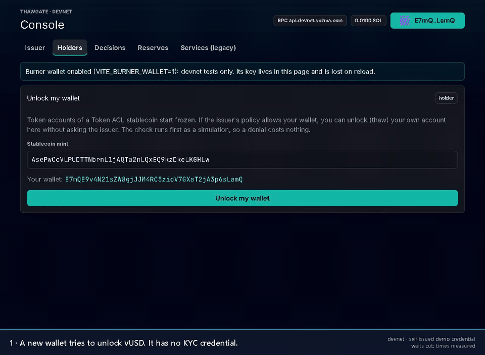
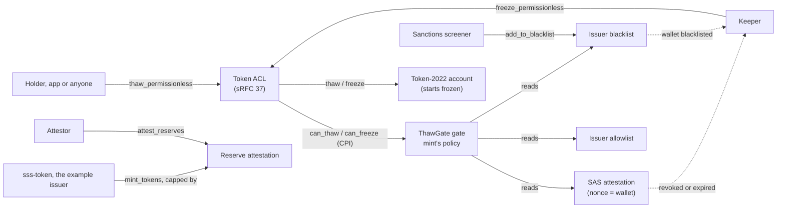

# ThawGate

> **ThawGate: KYC and sanctions gates for Solana's Token ACL. Wallets unlock a regulated token themselves with a valid credential and lose access when it is revoked. No transfer hook, so the token keeps working in DeFi.**

**Status: unaudited, devnet only.** Nothing is deployed to mainnet. Read [SECURITY.md](docs/thawgate/SECURITY.md) and its known limitations before you build on it.

[](https://github.com/AryaSingh22/thawgate/actions/workflows/gate-test.yml)
[](https://github.com/AryaSingh22/thawgate/actions/workflows/anchor-test.yml)
[](https://github.com/AryaSingh22/thawgate/actions/workflows/ts-tests.yml)
[](https://github.com/AryaSingh22/thawgate/actions/workflows/full-ci.yml)
[](https://github.com/AryaSingh22/thawgate/actions/workflows/ci.yml)



*Recorded on devnet with the ThawGate console, a burner wallet and vUSD, whose policy names a **self-issued demo credential** (no KYC provider issued it). Waits are cut. The keeper froze the account 1.8 s after the revoke. Transactions: [attest](https://explorer.solana.com/tx/363BgzkbVRpwKXMXMNnsuurd6BU9o1YKtMjGPHS5htVYvaxLsvYDDUocNox8xYHPvPPSRW38Jx1cWeKecwtTCNpy?cluster=devnet) → [unlock](https://explorer.solana.com/tx/51FXELY3DfujaGXh4CgZBmbSCoJrxnv7jHKewir6omoLVS8YPCD965P5X6ncQB9YaEEspKrHWEf8cJ5893R7j7tk?cluster=devnet) → [revoke](https://explorer.solana.com/tx/64otzREAhWeDbjU1CR2awWUA2fhnHxKKdFEsoVtdUnAcAo7aJpQwxRsFLspgM8BUbRWNfv7vW4x7MQiBjH6HwRvQ?cluster=devnet) → [keeper freeze](https://explorer.solana.com/tx/3CLEESazrqHicop8HFFHWRNWjdQPhySKaziPtB39SJBTuekJ1hw3W6k2SoYEi9W7VmUypsAKiigFY7e3WenosJhA?cluster=devnet) ([LOG S16](docs/gatekit/LOG.md#s16--2026-10-06--rebrand-polish-and-docs)).*

## How it works



- A Token ACL mint uses DefaultAccountState = Frozen, so **every token account starts frozen**.
- **A holder unlocks their own account** with Token ACL's `thaw_permissionless`. Token ACL asks ThawGate, which reads the mint's policy: a live [SAS](https://attest.solana.com) attestation for the wallet, the issuer's blacklist, the issuer's allowlist. The account must have ImmutableOwner. Anyone can pay; the issuer signs nothing.
- **A holder who stops complying** (credential revoked or expired, blacklisted, or below a tightened policy) becomes freezable by **anyone**, and the keeper freezes them. The [sanctions screener](docs/thawgate/SANCTIONS.md) blacklists wallets a risk provider flags.
- **No transfer hook.** The check runs once per account, at thaw. After that, a transfer is plain Token-2022: 3,557 CU on an sss-token Token ACL mint, against 27,627 CU on an sss-token mint with the SSS transfer hook (localnet, [LOG S6b](docs/gatekit/LOG.md#s6b--2026-09-29--sss-token-token-acl-mode-and-the-hook-on-a-validator-legacy-seize-sdk-presets)).
- **Every decision is logged** as `TG:ALLOW:<CODE>` or `TG:DENY:<CODE>`, and `explain()` gives the same reason before anything is sent.
- **The example issuer caps minting at attested reserves** ([RESERVES.md](docs/thawgate/RESERVES.md)).

The spec is [GATE.md](docs/thawgate/GATE.md). To integrate, start with [INTEGRATING.md](docs/thawgate/INTEGRATING.md).

## Quickstart (devnet)

One script, from a fresh wallet: your own test KYC credential, a stablecoin gated by it, a holder refused, attested, unlocked, minted to, revoked and frozen. Every step is a real devnet transaction.

**You need:** Node ≥ 22.12 (to build the SDK from this repo; the built SDK runs on Node 20 and 22), yarn 1 (`npm i -g yarn`) and git.

`@thawgate/sdk` isn't on npm yet (v0.1.0 is planned), so build its package from this repo first:

```bash
git clone https://github.com/AryaSingh22/thawgate && cd thawgate
yarn install --frozen-lockfile
yarn workspace @thawgate/sdk build
cd sdk && npm pack && cd ../..        # creates thawgate/sdk/thawgate-sdk-0.1.0.tgz
```

Then run the quickstart in a new folder next to the clone:

```bash
mkdir thawgate-quickstart && cd thawgate-quickstart
npm init -y
npm i ../thawgate/sdk/thawgate-sdk-0.1.0.tgz @solana/web3.js
cp ../thawgate/sdk/examples/quickstart.mjs .
node quickstart.mjs
```

The first run creates `issuer.json` (a new wallet) and asks the devnet faucet for 1 SOL. The faucet often refuses. Then the script prints the wallet's address and stops: send that address 0.2 devnet SOL from <https://faucet.solana.com>, and run `node quickstart.mjs` again. It ends with `freezeIfInvalid: frozen=true NO_CREDENTIAL` and `done`.

What each step does, its sample output and the timed runs are in [sdk/README.md](sdk/README.md#quickstart-5-minutes-on-devnet-from-a-fresh-wallet). From an empty folder with the SDK package, the funded run took 39.1 s on Node 22 and 43.4 s on Node 20, not counting the funding ([LOG S11](docs/gatekit/LOG.md#s11--2026-10-03--10-04--sdk--cli-thawgatesdk-the-thawgate-binary-a-timed-quickstart)).

Next: the [`thawgate` CLI](cli/README.md) does the same from a shell, and the [console](#console) does it in a browser wallet.

## What's live on devnet

Each number links to the log entry or the transactions that measured it.

| What | Result | Evidence |
|---|---|---|
| Mints gated by ThawGate on devnet | 15, all created by this project's tests and demos. No external integrator yet. | [LOG S16](docs/gatekit/LOG.md#s16--2026-10-06--rebrand-polish-and-docs) |
| Credential revoked → account frozen by the keeper, no manual step | p50 2,863 ms over 10 runs; p50 2,042 ms over 10 runs after the S15a upgrade | [LOG S8](docs/gatekit/LOG.md#s8--2026-10-01--keeper-freeze-crank-serviceskeeper), [LOG S15a](docs/gatekit/LOG.md#s15a--2026-10-04--sss-token-fixes-in-one-devnet-upgrade-thawgate-reserves-post-legacy-e2e-green) |
| Sanctions flag → blacklisted → frozen | p50 3,714.5 ms over 10 runs, on the labelled static list | [LOG S10](docs/gatekit/LOG.md#s10--2026-10-03--sanctions-screener-provider-result--blacklisted--frozen-by-the-keeper) |
| A KYC'd holder trades; after the revoke the keeper freezes them and their next trade fails | in `demo_pool`, the demo venue: [swap](https://explorer.solana.com/tx/443r1ucqQhhE4w1UxJJryaydSEYKQFAS6FchTqDcagmVuNX9LfM8g2tJcXny7zrZNaT6mxRsjn5GaQeXed1quvz9?cluster=devnet), [keeper freeze](https://explorer.solana.com/tx/3N8zvh2j3WXJ3zgafYCtt47zNseJ7fWsM5kefns2B78Xs4Q1jsXunMYYXcYo3bqrUH7J7JfDeJj8vmGPAyTKsQzj?cluster=devnet), [refused swap](https://explorer.solana.com/tx/59dd4R7onZzpxsBEGdwg3oxSyLYhSGsaZTr7p93dqVVT4fB9oVyRtcActJh5pbW6sPUJNvKkGRkUB3eELNRHZfTJ?cluster=devnet) | [LOG S12-venue](docs/gatekit/LOG.md#s12-venue--2026-10-04--the-demo-venue-a-gated-token-trading-in-a-pool-on-devnet) |
| A mint past attested reserves is refused (`ReserveInsufficient`) | the refusal landed on chain: [tx](https://explorer.solana.com/tx/5uyH7QMRWCmTvkL394A8HhFXBptKjG7wm5WvAqkbTVndizkcHefBjBn7QH6R736s7LUgXjHB8jFzMHHaQsJC7Sdc?cluster=devnet) | [LOG S14](docs/gatekit/LOG.md#s14--2026-10-04--console-ii-mint-action-decisions-and-reserves-on-devnet) |
| Gate cost per thaw (localnet) | 26,191–40,426 CU per transaction, gate frame 3,385–5,400, once per account | [LOG S6b](docs/gatekit/LOG.md#s6b--2026-09-29--sss-token-token-acl-mode-and-the-hook-on-a-validator-legacy-seize-sdk-presets) |
| Fuzzing the gate's thaw/freeze decision (Trident) | 4 runs × 99,600 flows, no invariant failure | [LOG S15b](docs/gatekit/LOG.md#s15b--2026-10-05--security-review-trident-on-the-gate-c2-feature-freeze) |
| CI | all five workflows green on the C2 freeze commit | [Gate Tests](https://github.com/AryaSingh22/thawgate/actions/runs/37355271808), [Anchor Integration](https://github.com/AryaSingh22/thawgate/actions/runs/37355271872), [TypeScript](https://github.com/AryaSingh22/thawgate/actions/runs/37355271892), [Full CI](https://github.com/AryaSingh22/thawgate/actions/runs/37355271938), [CI](https://github.com/AryaSingh22/thawgate/actions/runs/37355271833) |

**Range** (the sanctions risk provider): adapter built, tested against mocks; the demo uses the labelled static list. No live Range call has been made.

## Program IDs (devnet)

| Program | ID | Role |
|---|---|---|
| ThawGate gate | [`THAW2daLXyUtCLtTsJWDTKZctiAGmGX4wT1kqKXugUZ`](https://explorer.solana.com/address/THAW2daLXyUtCLtTsJWDTKZctiAGmGX4wT1kqKXugUZ?cluster=devnet) | The Token ACL gating program ([GATE.md](docs/thawgate/GATE.md)) |
| sss-token | [`HLvhfKVfGfKXVNS9tZ1q7SNS4w9mQmcjre758QFhbZDZ`](https://explorer.solana.com/address/HLvhfKVfGfKXVNS9tZ1q7SNS4w9mQmcjre758QFhbZDZ?cluster=devnet) | The example issuer: the SSS baseline, extended with a Token ACL mode and reserve-capped minting ([docs/examples/sss/](docs/examples/sss/README.md)) |
| transfer_hook | [`2wcwbEsw7rZ2t36qaDujHUc9HHrg3f5m4opcSHpixNUv`](https://explorer.solana.com/address/2wcwbEsw7rZ2t36qaDujHUc9HHrg3f5m4opcSHpixNUv?cluster=devnet) | The SSS hook, for sss-token's legacy hook mode only |
| demo_pool | [`9oYxeFvSLhgq8rqh4BRJA1gRyMX53j7gt9jYzNZhLaKS`](https://explorer.solana.com/address/9oYxeFvSLhgq8rqh4BRJA1gRyMX53j7gt9jYzNZhLaKS?cluster=devnet) | The demo venue; any protocol that separates pool init from deposit works the same way ([README](programs/demo-pool/README.md)) |
| Token ACL | [`TACLkU6CiCdkQN2MjoyDkVg2yAH9zkxiHDsiztQ52TP`](https://explorer.solana.com/address/TACLkU6CiCdkQN2MjoyDkVg2yAH9zkxiHDsiztQ52TP?cluster=devnet) | Solana Foundation, not ours |
| SAS | [`22zoJMtdu4tQc2PzL74ZUT7FrwgB1Udec8DdW4yw4BdG`](https://explorer.solana.com/address/22zoJMtdu4tQc2PzL74ZUT7FrwgB1Udec8DdW4yw4BdG?cluster=devnet) | Solana Attestation Service, not ours |

Each of our programs has a single-key upgrade authority on devnet ([SECURITY.md limitation 2](docs/thawgate/SECURITY.md#known-limitations)). Deployments and their hashes: [DEPLOYMENT.md](DEPLOYMENT.md).

## Built on
- [Token ACL](https://github.com/solana-foundation/token-acl) (sRFC 37), the Solana Foundation's permissioned-token program. ThawGate is a gating program for it.
- [Solana Attestation Service](https://github.com/solana-foundation/solana-attestation-service) (SAS): the KYC credential is a SAS attestation whose nonce is the holder's wallet.
- Token-2022 extensions: DefaultAccountState, ImmutableOwner, Pausable, PermanentDelegate.
- [Anchor](https://github.com/solana-foundation/anchor) 0.32.2.
- The author's pre-hackathon [Solana Stablecoin Standard](https://github.com/solanabr/solana-stablecoin-standard) bounty entry, which became the example issuer. What existed before the hackathon and what was built during it: [DISCLOSURE.md](docs/gatekit/DISCLOSURE.md).

## Docs
- **ThawGate** ([docs/thawgate/](docs/thawgate/README.md)): [integrator guide](docs/thawgate/INTEGRATING.md), [gate spec and reason codes](docs/thawgate/GATE.md), [policy configuration](docs/thawgate/POLICY.md), [keeper operations](docs/thawgate/KEEPER.md), [reserves](docs/thawgate/RESERVES.md), [sanctions](docs/thawgate/SANCTIONS.md), [security](docs/thawgate/SECURITY.md).
- **Packages:** [@thawgate/sdk](sdk/README.md), [`thawgate` CLI](cli/README.md), [keeper](services/keeper/README.md), [attestor](services/attestor/README.md), [sanctions screener](services/compliance-service/README.md).
- **The example issuer (SSS):** [docs/examples/sss/](docs/examples/sss/README.md).
- **Build log, plan and research:** [docs/gatekit/](docs/gatekit/LOG.md). The submission text is [SUBMISSION.md](SUBMISSION.md).

## Console

`frontend/` is the ThawGate console. It runs client-side on devnet with Phantom or Solflare, through `@thawgate/sdk`:
- `/issuer`: a wizard that creates a stablecoin, sets its policy and enables Token ACL, plus a Mint card that refuses past reserves in plain words;
- `/holders`: "Unlock my wallet", with the gate's reason and `TG:` code;
- `/decisions` (no wallet): for each wallet of a mint, allowed or denied and why, with the last gate decision on chain;
- `/reserves` (no wallet): supply against attested reserves, and the refused mints.

```bash
yarn install && yarn workspace @thawgate/sdk build   # the console installs the built SDK from ../sdk
cd frontend && npm install && npm run dev            # http://localhost:3000
```

`/decisions` also reads a keeper (`VITE_KEEPER_URL`, default `http://localhost:3005`). Never put a keyed RPC URL in the frontend: every `VITE_*` variable ends up in the public bundle. Screenshots are in [docs/thawgate/screenshots/](docs/thawgate/screenshots/).

## Repository

```
programs/thawgate-gate/   the Token ACL gate (ThawGate)
programs/sss-token/       the example issuer (SSS baseline + Token ACL mode + reserves)
programs/transfer-hook/   the SSS transfer hook (legacy hook mode)
programs/demo-pool/       the demo venue
sdk/  cli/                @thawgate/sdk and the thawgate CLI
services/keeper/          freeze crank
services/attestor/        reserve attestor
services/compliance-service/  SSS compliance API + the sanctions screener
services/{mint-service,indexer,webhook-service,shared}/  SSS backend services
frontend/                 the console
tests/                    localnet and devnet suites (fixtures: devnet program dumps)
trident-tests/            the gate's fuzz target
docs/                     thawgate/, examples/sss/, gatekit/ (log, plan, research)
evidence/                 pre-hackathon test logs, kept unchanged
```

Building and testing: [CLAUDE.md](CLAUDE.md#commands) has the commands (`anchor build`, `yarn test:gate`, …).

## License

MIT. See [LICENSE](LICENSE).
